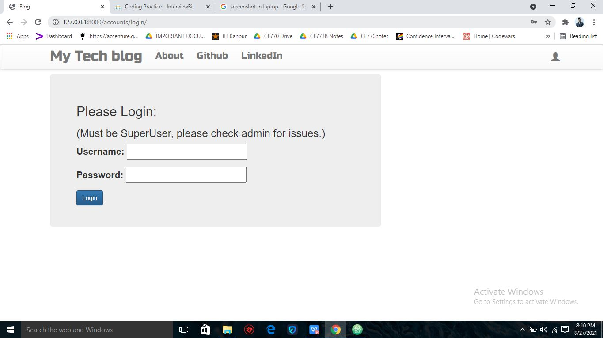
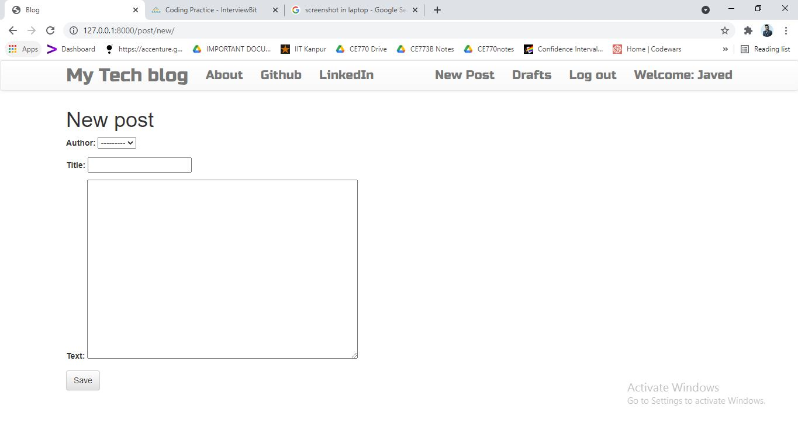
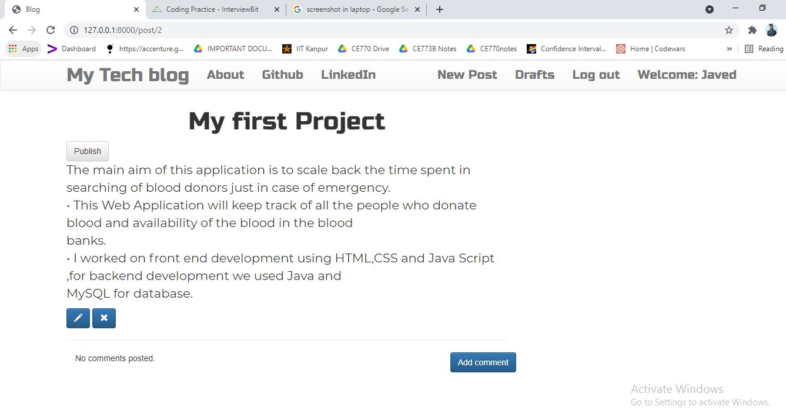
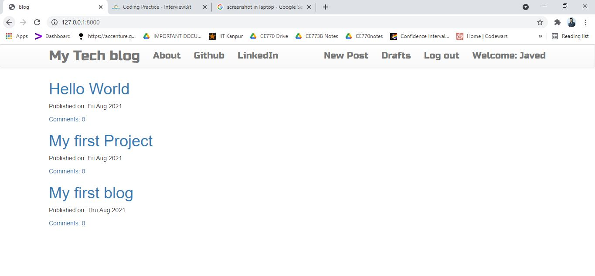

# MyBlog-Web-Application
• Provide user User Authentication using Login and SignUp . 

• Provide facility to creat,edit,delete and publish the blog post.Also provide commenting facility to the readers.

• Django web framework is used for application development.Backend using Python and frontend using HTML and CSS.

## Login

 

## Creating New Blog

 

## Modifing and Publishing Blog

 

## List of all Published Blogs

 
